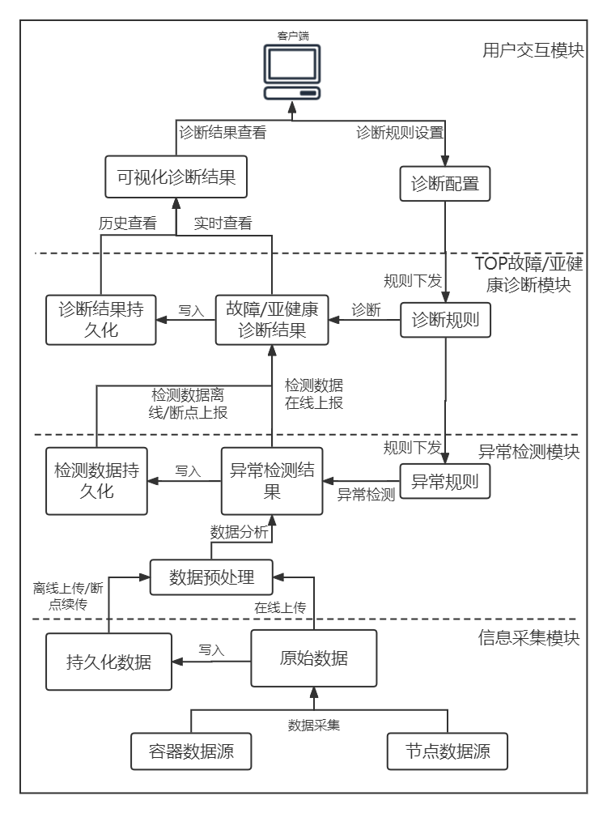

#### Description

> English | [中文](README.md)

[CPDS](https://gitee.com/openeuler/Cpds) (Container Problem Detect System) is a container cluster problem detection system, it's designed and developed by [Linx Software Co., Ltd.](https://www.linx-info.com) The software system realizes the monitoring and identification of container TOP faults and sub-health detection.

#### Features

 **1. Collect cluster information**

The node agent is implemented on the host computer, and the key services of the container are monitored using systemd, initv, ebpf and other technologies; Collect node network, kernel, disk LVM and other relevant information; Monitor the application status, resource consumption, key system function execution, IO execution status and other execution exceptions in the container.

**2. Cluster anomaly detection**

Collect the original data of each node, detect the anomaly of the collected original data based on the anomaly rules, and extract the key information. At the same time, anomaly detection is performed on the collected data based on the anomaly rules, and then the detection result data and the original data are uploaded online, and the persistence operation is performed synchronously.

**3. Node and service container fault/sub-health analyze**

Based on the anomaly detection data, fault/sub-health diagnosis is performed on nodes and business containers, the analysis and detection results are stored persistently, and the UI layer is provided for real-time and historical diagnosis data viewing

## Architecture

Container Problem Detect System (CPDS) The container problem detect system (CPDS) consists of four component groups that use the microservice architecture and communicate with each other through API。

* [cpds-agent](https://gitee.com/openeuler/cpds-agent)：The information collection component is responsible for collecting the container and original system data of each node in the cluster

* [cpds-detector](https://gitee.com/openeuler/cpds-detector)：The anomaly detection component analyzes the original data of each node according to the configured anomaly rules to detect whether there are exceptions in the node  

* [cpds-analyzer](https://gitee.com/openeuler/cpds-analyzer)：The fault/sub health diagnosis component performs health analysis on abnormal nodes according to the configured diagnosis rules, and calculates the current health status of nodes

* [cpds-dashboard](https://gitee.com/openeuler/cpds-dashboard)：User interaction component, providing web pages to display the health of nodes in the cluster, and supporting the distribution of diagnostic rule configuration  

## Installation

CPDS runs on the Linux platform, and the installation and deployment methods are detailed in the README documents of each component

#### Work plan

1. Design and implement the overall software layered architecture, from information collection to user interaction. 2022.11.14 ~ 2022.12.5
2. Sort out and abstract the fault types of containers. 2022.12.6 ~ 2023.2.2
3. Software design and development. 2023.3.3 ~ 2023.8.31
4. Operate the community and continuously develop and improve the system; long-term

## Committer

<table>
    <thead>
        <tr>
            <th>component</th>
            <th>code reviewer</th>
            <th>repo owner</th>
        </tr>
    </thead>
    <tbody>
        <tr>
            <td>
                <a href="https://gitee.com/openeuler/cpds-agent">cpds-agent</a>
            </td>
            <td>
                <a href="https://gitee.com/linx-fxli">@Feixiang Li</a>
                <a href="https://gitee.com/zeng-junhan">@Junhan Zeng</a>
                <a href="https://gitee.com/weicao123">@Wei Cao</a>
            </td>
            <td>
                <a href="https://gitee.com/pencc">@Yixiang Peng</a>
            </td>
    </tr>
    <tr>
            <td>
                <a href="https://gitee.com/openeuler/cpds-detector">cpds-detector</a>
            </td>
            <td>
                <a href="https://gitee.com/linx-fxli">@Feixiang Li</a>
                <a href="https://gitee.com/jwzhangcn">@Jingwei Zhang</a>
            </td>
            <td>
                <a href="https://gitee.com/pencc">@Yixiang Peng</a>
            </td>
    </tr>
    <tr>
            <td>
                <a href="https://gitee.com/openeuler/cpds-analyzer">cpds-analyzer</a>
            </td>
            <td>
                <a href="https://gitee.com/linx-fxli">@Feixiang Li</a>
                <a href="https://gitee.com/jwzhangcn">@Jingwei Zhang</a>
            </td>
            <td>
                <a href="https://gitee.com/pencc">@Yixiang Peng</a>
            </td>
    </tr>
    <tr>
            <td>
                <a href="https://https://gitee.com/openeuler/cpds-dashboard">cpds-dashboard</a>
            </td>
            <td>
                <a href="https://gitee.com/linx-fxli">@Feixiang Li</a>
                <a href="https://gitee.com/SaarHV">@Haonan Du</a>
            </td>
            <td>
                <a href="https://gitee.com/pencc">@Yixiang Peng</a>
            </td>
    </tr>
    </tbody>
</table>

## Guidance, discussion and contribution

### Contribution

1.  Fork the repository
2.  Create Feat_xxx branch
3.  Commit your code
4.  Create Pull Request

### Encountered a problem

Please submit any CPDS bugs, issues, and feature requests to [CPDS gitee Issue](https://gitee.com/openeuler/Cpds/issues)中